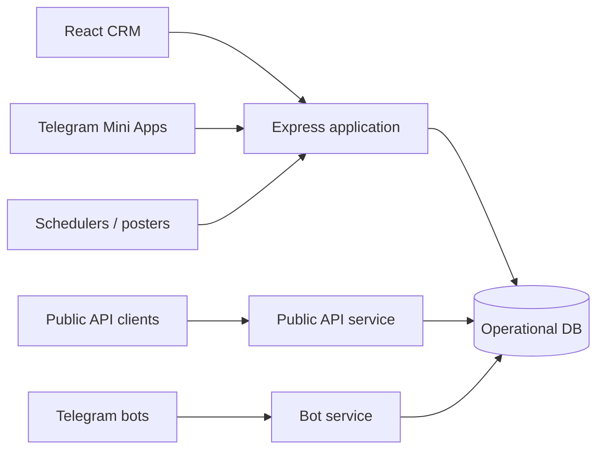

  

  
  
  
  
  

# Automotive CRM — public engineering showcase

An operational CRM ecosystem built around the day-to-day workflows of an automotive business.

The original repository is private. This showcase documents the system design and engineering surface without exposing business data, credentials or proprietary implementation.

## More than a CRUD app

The platform combines several runtimes around one operational domain:

## System components

- Main operational CRM web application.
- Public API service.
- Telegram bot services.
- Multiple Telegram Mini Apps.
- Scheduled and event-driven operational jobs.
- Containerised deployment with Docker Compose.
- Shared persistent data and uploaded media.
- Structured logging and production configuration boundaries.

## Engineering surface

| Area | Implementation |
|---|---|
| API | Node.js + Express |
| UI | React |
| Persistence | SQLite in the current deployment profile |
| Auth | JWT-based application auth |
| Protection | Helmet, rate limiting, validation |
| Files | Uploads, image processing, XLSX/DOCX flows |
| Operations | cron jobs, bots, public API, mini-apps |
| Tests | Jest, Supertest and client tests |

## Why it is interesting

The engineering challenge is the **integration of operational channels**, not just individual screens. Staff UI, bots, mini-apps and public APIs all have to agree on the same business state and failure semantics.

## Repository map

- [Architecture](docs/ARCHITECTURE.md)
- [Operational boundaries](docs/OPERATIONS.md)
- [Sanitised API example](examples/vehicle-api.js)

## Source availability

This repository is a public portfolio artefact. The production source remains private.
