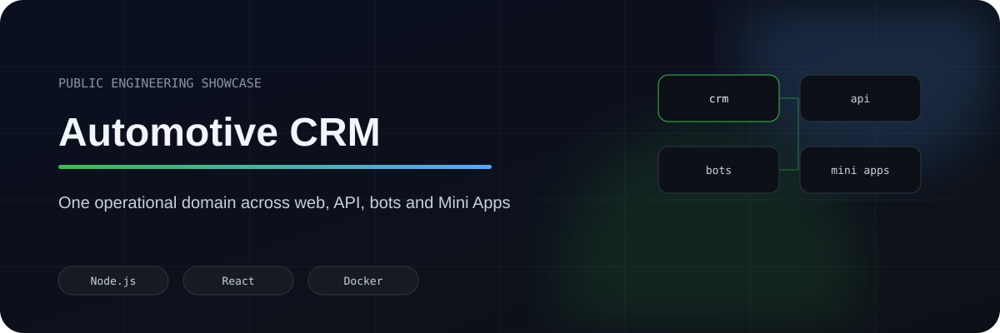
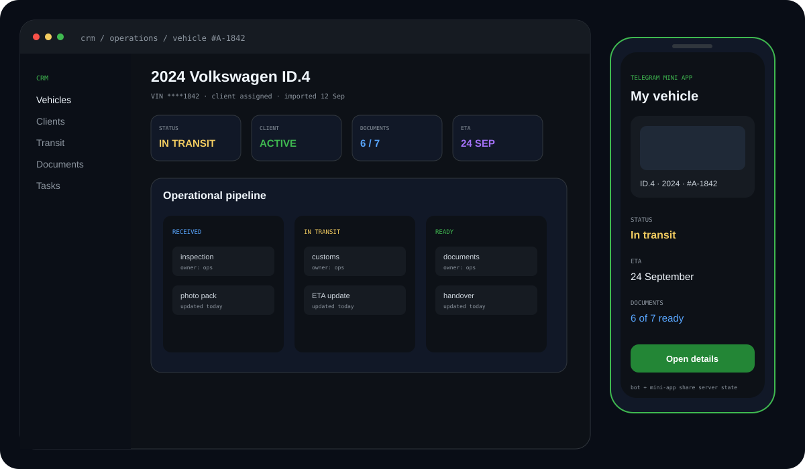
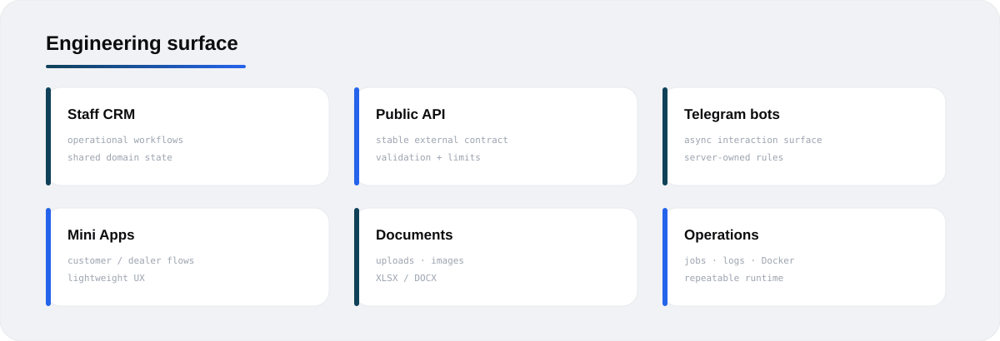
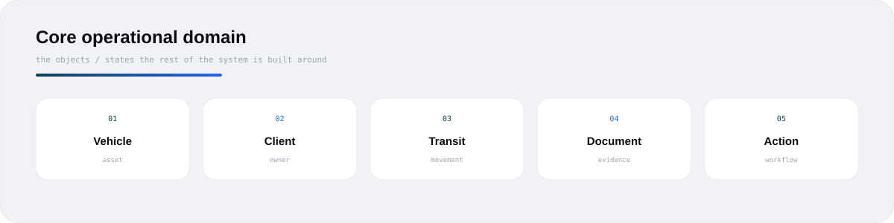
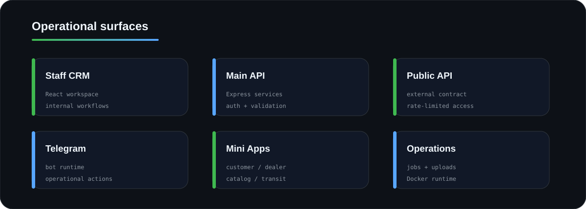
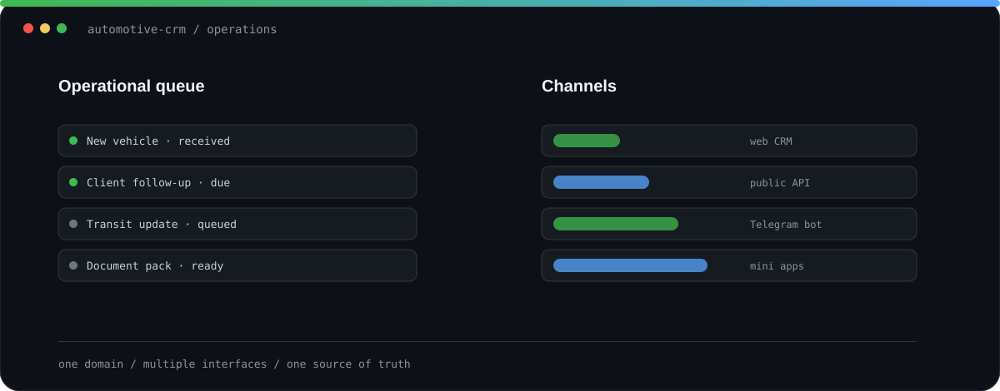
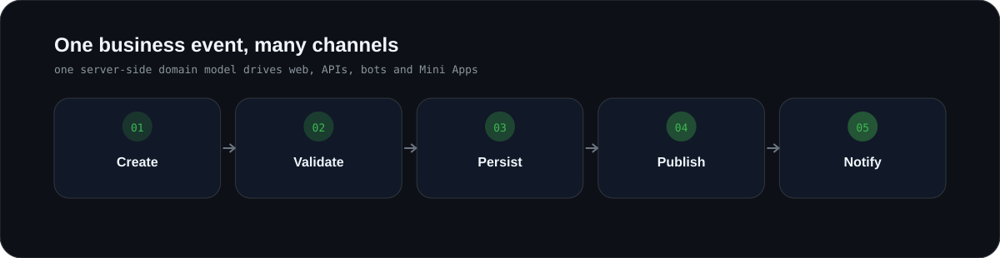
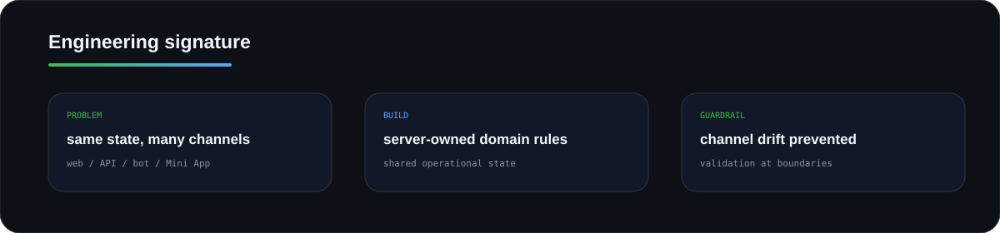

  
  
  
  
  

# Automotive CRM

Engineering work I did in a real operational CRM codebase spanning **staff web, public API, Telegram bots, Mini Apps and scheduled operations**.

The product/business is not presented as mine; the code and system work shown here is the part I worked on myself.

## <code>01 / surfaces</code>

## <code>02 / core_model</code>

## <code>03 / topology</code>

## <code>04 / one_domain_many_channels</code>

The rule is simple: **if web, API, bot and Mini App touch the same business state, the rule belongs on the server once.**

## <code>05 / hard_parts</code>

- stable shared state across multiple interfaces;
- auth / validation / rate limits at the right boundaries;
- uploads, image processing and document flows;
- scheduled operational jobs that should not need babysitting;
- independently restartable Docker services with shared persistence;
- server, bot and client test layers.

## <code>06 / engineering_signature</code>

  

## <code>07 / inspect</code>

- [Architecture](docs/ARCHITECTURE.md)
- [Operational boundaries](docs/OPERATIONS.md)
- [Sanitised API route](examples/vehicle-api.js)

<b>Public / private boundary</b>

No customer data, credentials, production domains, deployment hosts or proprietary business procedures are published here.

