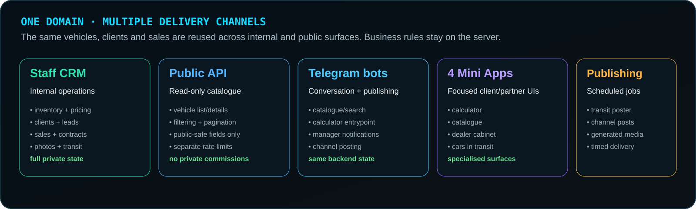
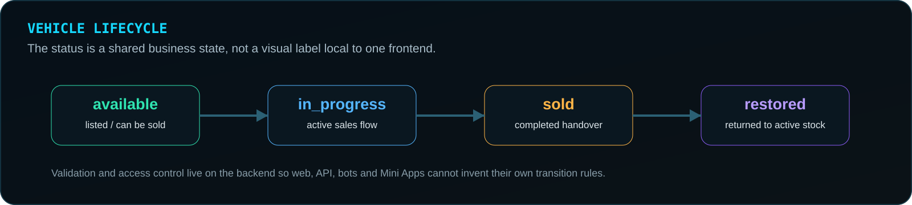

> **An operational dealership ecosystem, not one CRM screen.**  
> Internal staff, public catalogue users, Telegram users and dealer/transit flows all consume the same backend-owned vehicle/client/sale state.

<table>
<tr>
<td align="center"><b>Node.js 18</b> backend</td>
<td align="center"><b>Express</b> API / business logic</td>
<td align="center"><b>React 18</b> staff CRM</td>
<td align="center"><b>SQLite WAL</b> main operational DB</td>
<td align="center"><b>4 Mini Apps</b> focused Telegram UIs</td>
<td align="center"><b>Docker Compose</b> runtime</td>
</tr>
</table>

## Staff workspace

<table>
<tr>
<td width="33%" valign="top"><b>Inventory</b> Vehicles, VIN/specs, pricing, status, location, media and public visibility.</td>
<td width="33%" valign="top"><b>Clients & leads</b> Customer records, buyer/seller roles, notes, history and communication context.</td>
<td width="33%" valign="top"><b>Sales</b> Offers, reservations, contracts, payment state, commission context, delivery and handover.</td>
</tr>
</table>

## How the ecosystem is split

> The point of the architecture is that **the Staff CRM is not the source of truth by itself**.  
> The backend owns the domain, while the Staff SPA, public API, bots and Mini Apps are different delivery channels.

## Shared vehicle state

<table>
<tr>
<td width="50%" valign="top"><b>Why this matters</b> A vehicle becoming sold must mean the same thing in the CRM, public catalogue, dealer view and bot. Shared transitions prevent one interface from publishing stale or contradictory state.</td>
<td width="50%" valign="top"><b>Who can do what</b> JWT, server-side roles, validation and separate public/private API boundaries decide whether a caller may read or mutate a state.</td>
</tr>
</table>

## Media, documents & automation

<table>
<tr>
<td width="33%" valign="top"><b>Photos</b> Multi-image upload and image processing/optimisation for inventory records and public presentation.</td>
<td width="33%" valign="top"><b>Documents</b> Contracts and printable business documents are generated from the same operational data rather than copied by hand.</td>
<td width="33%" valign="top"><b>Scheduled publishing</b> Transit posters and channel posts are produced by background jobs instead of manual duplicate entry.</td>
</tr>
</table>

## Architecture

<table>
<tr>
<td width="33%" valign="top"><b>Private core</b> Express API + SQLite + role/validation rules serve the operational staff workflow.</td>
<td width="33%" valign="top"><b>Public edge</b> A separate read-only public API exposes catalogue-safe fields without private procurement prices or commissions.</td>
<td width="33%" valign="top"><b>Independent services</b> Bot, transit poster and Mini App builds can be restarted/deployed separately while sharing the same domain state.</td>
</tr>
</table>

## Operational flow

<b>Security / operations notes</b>

- JWT is stored in an httpOnly cookie.
- Server-side role checks protect private operations.
- Public API is intentionally read-only and omits private commercial fields.
- Helmet, validation and rate limits are part of the backend boundary.
- Docker Compose runs the app, public API, bots and supporting services; Mini Apps are built and served as static bundles.

