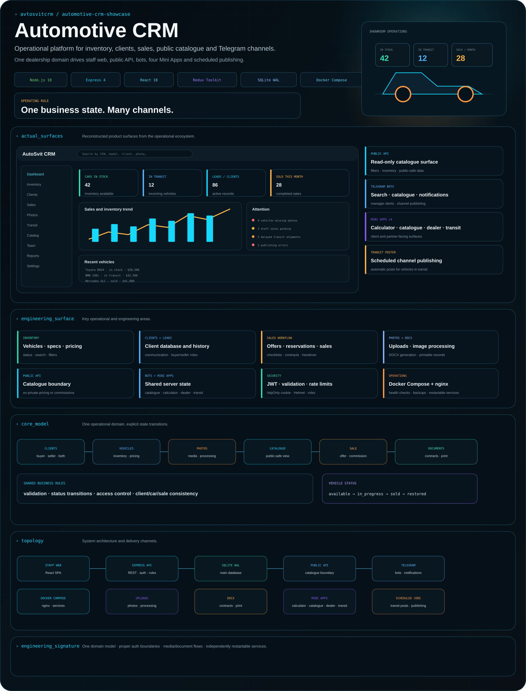

  
  
  
  
  

# Automotive CRM

Engineering work in a real operational automotive CRM ecosystem spanning **staff web, public API, Telegram bots, four Mini Apps and scheduled publishing**.

The business/product is not presented as mine; the system engineering shown here is the part I worked on.

> **One business state. Many channels.** If web, API, bot and Mini App touch the same operational state, the rule belongs on the server once.

## What the system covers

- vehicle inventory, pricing, status and media;
- clients and lead history;
- sales, commissions, checklists and documents;
- a read-only public catalogue API that excludes private commercial data;
- Telegram catalogue/calculator/notification flows;
- Mini Apps for calculator, catalogue, dealer and transit use cases;
- transit/channel publishing and scheduled operational jobs;
- JWT auth in httpOnly cookies, role checks, validation, rate limits and security headers;
- Docker Compose deployment with shared persistence, health checks and backup/restore procedures.

## Core state flow

**available → in_progress → sold → restored**

The same state is consumed by the staff CRM, public catalogue, bots and Mini Apps instead of being reimplemented independently per interface.

## Inspect

- [Architecture](docs/ARCHITECTURE.md)
- [Operational boundaries](docs/OPERATIONS.md)
- [Sanitised API route](examples/vehicle-api.js)

<b>Public / private boundary</b>

No customer data, credentials, production hosts, private pricing rules or proprietary dealership procedures are published here.

