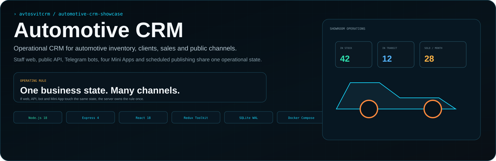
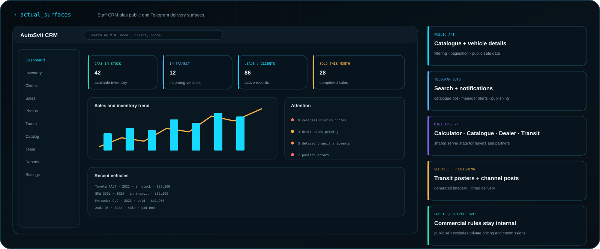
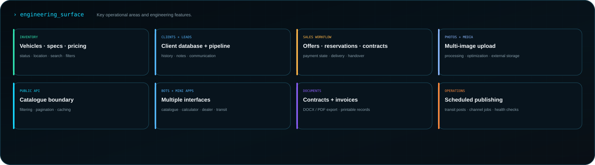
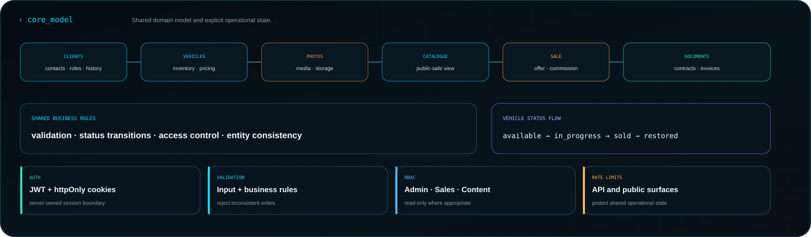
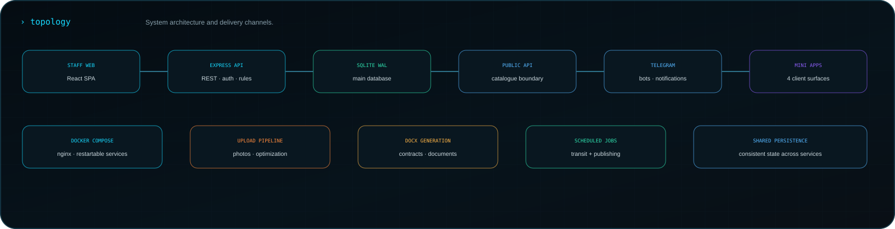
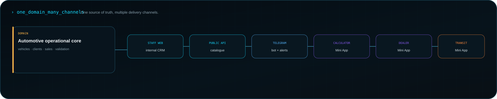
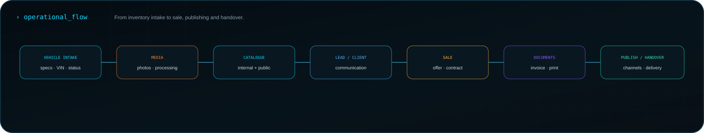
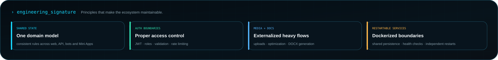

<table>
<tr>
<td width="50%" valign="top">

### What it is

Engineering work across an operational automotive CRM ecosystem.

One backend state is consumed by:

- staff CRM
- public catalogue API
- Telegram bots
- calculator Mini App
- catalogue Mini App
- dealer Mini App
- transit Mini App
- scheduled publishing jobs

</td>
<td width="50%" valign="top">

### Engineering focus

- shared business rules
- explicit vehicle lifecycle
- JWT / role boundaries
- media processing
- document generation
- public/private API separation
- restartable services
- shared persistence

</td>
</tr>
</table>

 

<table>
<tr>
<td width="52%" valign="top">

</td>
<td width="48%" valign="top">

### One domain, many channels

The same vehicle, client and sale state is reused across several interfaces.

The backend owns validation and state transitions once instead of rebuilding them independently in every UI or bot.

</td>
</tr>
</table>

 

<table>
<tr>
<td width="48%" valign="top">

### Topology

The system combines a staff SPA, Express API, SQLite WAL, public API, Telegram services, Mini Apps, media/document flows and scheduled jobs.

</td>
<td width="52%" valign="top">

</td>
</tr>
</table>

 

 

Private source · public engineering showcase
