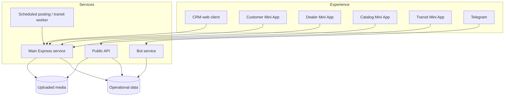

# Architecture

## Design concerns

### One domain, multiple interfaces

The system exposes the same operational domain through staff web UI, public API, bots and mini-apps. Business rules therefore belong in server-side services rather than being duplicated in clients.

### Deployment isolation

The stack is split into independently restartable services while sharing well-defined persistent volumes and environment-based configuration.

### Operational safety

Authentication, request validation, rate limits and structured logs live at service boundaries. External tokens and secrets are injected at runtime rather than committed.

### Testability

Server endpoints and bot flows are covered independently so channel-specific behaviour can be changed without treating the whole system as one black box.
